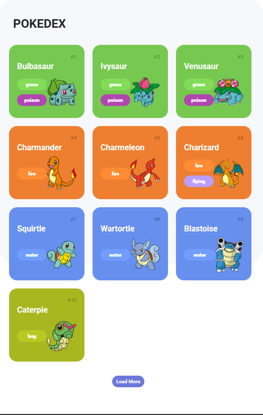
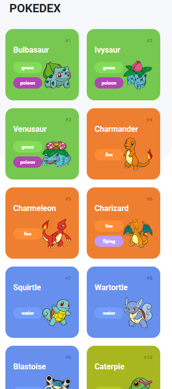
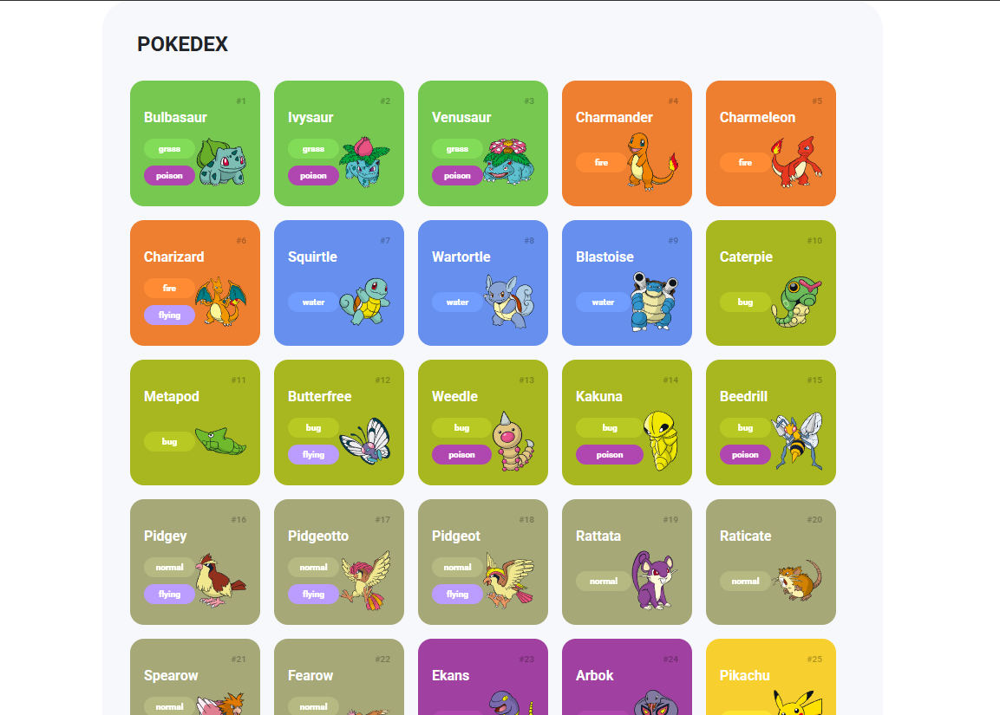

# Pokédex 🎮

Uma Pokédex interativa que consome a [PokéAPI](https://pokeapi.co/) para exibir os 151 Pokémons da primeira geração, com suas informações e tipos.

## 📸 Preview





## 🚀 Funcionalidades

- Cards com nome, número, tipo(s) e imagem de cada Pokémon
- Carregamento paginado com botão **"Load More"** (10 Pokémons por vez)
- Cores dos cards dinâmicas de acordo com o tipo do Pokémon
- Layout responsivo com Bootstrap 5

## 🛠️ Tecnologias

- HTML5
- CSS3
- JavaScript (ES6+)
- Bootstrap 5
- [PokéAPI](https://pokeapi.co/)

## 📁 Estrutura do Projeto

```
pokedex/
├── index.html
└── assets/
    ├── css/
    │   ├── global.css
    │   └── media.css
    └── js/
        ├── pokemonModel.js
        ├── pokemonApi.js
        └── main.js
```

## ▶️ Como executar

1. Clona o repositório:
   ```bash
   git clone https://github.com/cludtke/PokedexApp.git
   ```

2. Entra na pasta do projeto:
   ```bash
   cd pokedex
   ```

3. Abre o ficheiro `index.html` no browser — ou usa uma extensão como **Live Server** no VS Code.

> Não é necessário instalar dependências. O projeto usa apenas HTML, CSS e JavaScript puro.

## 📡 Como funciona

A aplicação faz chamadas à PokéAPI em dois passos:

1. Busca a lista de Pokémons com offset e limit (`/pokemon?offset=0&limit=10`)
2. Para cada Pokémon, busca os detalhes (tipos, imagem, número) individualmente

Todos os pedidos são tratados com `fetch` e `Promise.all` para carregar os cards em paralelo.

## 🎨 Tipos suportados

Os cards mudam de cor conforme o tipo principal do Pokémon:

`normal` · `grass` · `fire` · `water` · `electric` · `ice` · `ground` · `flying` · `poison` · `fighting` · `psychic` · `dark` · `rock` · `bug` · `ghost` · `steel` · `dragon` · `fairy`


> Projeto desenvolvido durante o bootcamp da [DIO (Digital Innovation One)](https://www.dio.me/).
